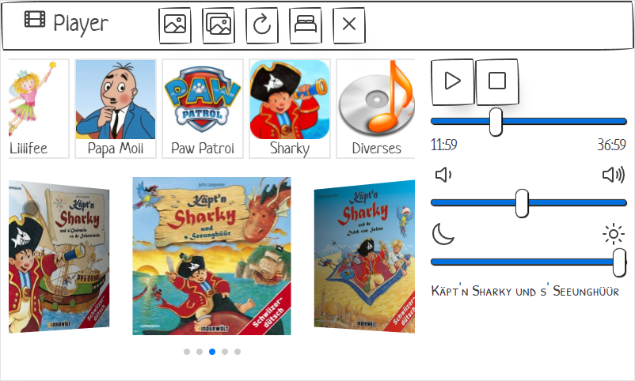

# TouchMediaPlayer

## Introduction
This project is a simplistic and child friendly media player, designed for the Raspberry Pi with the official 7" touch display.
After configuration, it can run fully offline or portable if you do have a battery for your Pi.


## Requirements
You need the following hardware for an optimal experience:
- Raspberry Pi (3B+ / 4B recommended) with an appropriate SD card
- Original Raspberry Pi 7" Touchscreen
- SmartiPi Touch 2 (Display Stand)
- Mini External USB Speaker (like https://www.adafruit.com/product/3369)
- Keyboard and Mouse for easier setup

## Installation and Setup
- Install Raspberry Pi OS onto the SD card
- Make sure to disable overscan
- Optionally install pavucontrol to easily control the default audio device without right click
- Install Node
  - Enable the node repository:
    ```
    sudo su
    curl -fsSL https://deb.nodesource.com/setup_17.x | bash -
    ```
  - Install NodeJS
    ```
    sudo apt install nodejs
    ```
- Clone this repository
  ```
  git clone https://github.com/Roemer/TouchMediaPlayer.git
  ```
- Switch into the cloned repository
  ```
  cd TouchMediaPlayer
  ```
- Install the dependencies
  ```
  npm i
  ```
- Copy the dependencies for the frontend
  ```
  npm run copy-frontend
  ```
- Prepare the media folder (see next chapter)
- Run the server
  ```
  npm run serve
  ```

## Media Folder
The structure of the media for the player is as follows:
```
media
  - audio
    - group 1
      - folder.jpg -> Image that is served as group cover (100x100 is enough)
      - info.yaml -> Information file for the group
      - album 1
        - folder.jpg -> Image for this album
        - info.yaml -> Information file for the album
        - album.mp3
      - album 2
      - ...
    - group 2
    - ...
```

The group info.yaml looks like:
```
title: GroupTitle
```

The album info.yaml looks like:
```
title: AlbumTitle
media: UrlToAudioFile
```
The media is optional. Either place an mp3 in the album folder or specify an url where the media resides.

## Development
Development can be done locally, via VSCode Remote SSH or even VSCode Remote Container.

If you use remoting on the Raspberry Pi, it might freeze due to heavy load from the language server. To prevent that, disable the Typescript and Javascript langauge server from the extensions by searching for `@builtin TypeScript` and disable it for the pi.
